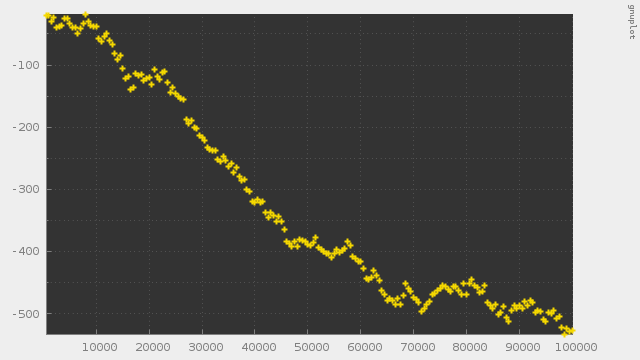
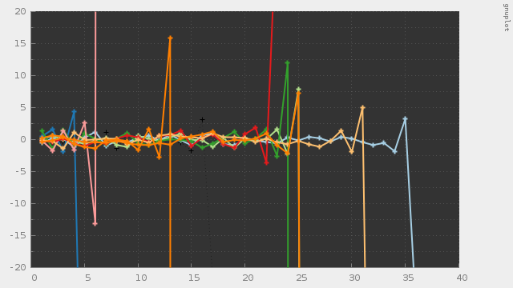
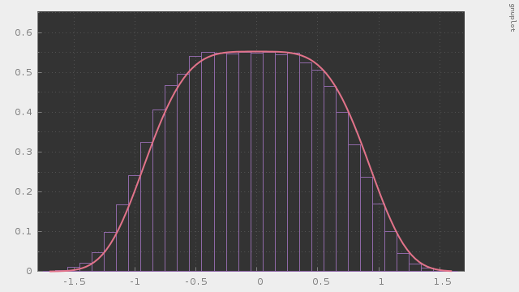

# mcmc-mala

Metropolis Adjusted Langevin Algorithm

---

## これは何？

MCMCのMetropolis Adjusted Langevin Algorithm (MALA)のC++によるフルスクラッチです。

ランジュバン方程式を利用したMCMCは以下のようなケースでは上手くいきません。
- 確率過程が定常分布を持たない。
- 確率過程は定常分布を持つが、オイラー近似を行ったものに関して定常分布を持たない。

これらの問題に対処するためにLMCにメトロポリス法の棄却ステップを導入したものがMALAです。

## 動作サンプル

LMCで exp(-|x|^0.5) に従う乱数を発生させたときのトレースラインです。確率微分方程式が定常分布を持たないため、発散してしまいます。

LMCで exp(-|x|^4) に従う乱数を発生させたときのトレースラインです。確率微分方程式は定常分布を持ちますが、オイラー近似を行ったものに関しては定常分布を持たないため、発散してしまいます。

MALAで exp(-|x|^4) に従う乱数を発生させた例です。

